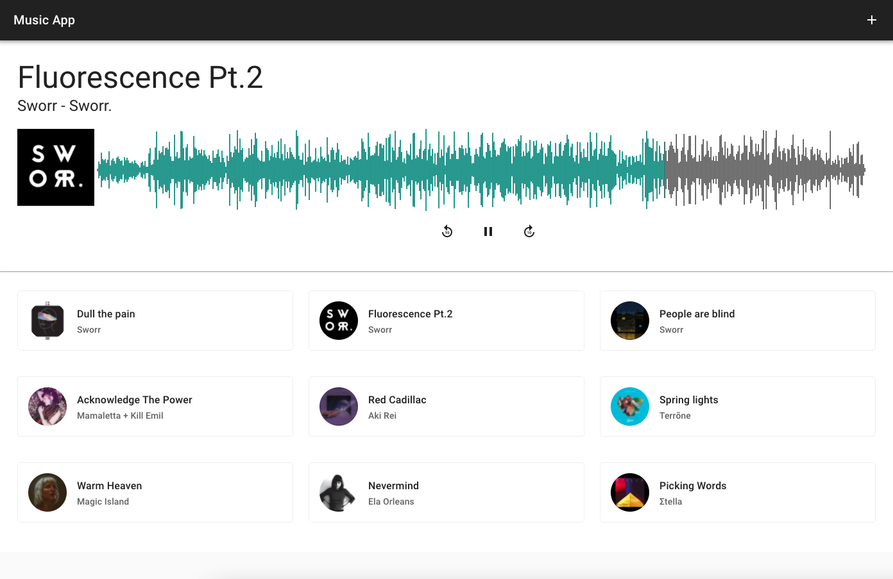
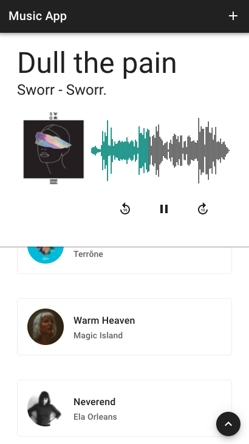
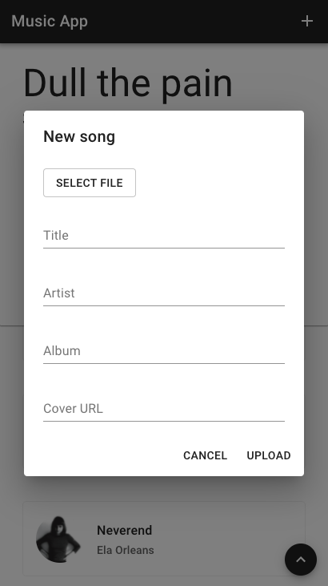

# Music waveform visualization

A music playground project, in order to list and play your music. This is the initial version, implementing some basic features, mainly focused on [waveform](https://en.wikipedia.org/wiki/Waveform#:~:text=In%20electronics%2C%20acoustics%2C%20and%20related,of%20any%20displacement%20in%20time.) visualization.

## Built with

- [React.js](https://reactjs.org/)
- [Redux](https://redux.js.org/)
- [Redux Thunk](https://github.com/reduxjs/redux-thunk)
- [Material-UI](https://material-ui.com/) components as an implementation of [Google's Material Design](https://material.io/design)
- [axios](https://github.com/axios/axios)
- [wavesurfer.js](https://wavesurfer-js.org/) library in order to produce song's waveform visualization

## Features
- List uploaded tracks
- Select a track to play
- Produce waveform visualization for current playing track
- Force player at any track position using the cursor on waveform
- 10 seconds forward
- 10 seconds backward
- Play/Pause

# App Screenshots

### Web

<table>
  <tr>
    <td></td>
  </tr>
</table>

### Mobile

<table>
  <tr>
    <td></td>
    <td></td>
  </tr>
</table>

## Quick Start

### Prerequisites

#### 1. Create a `.env` file at project's root directory, running the following command:

```console
$ touch .env
```
Define needed project environment variables as key/value pairs inside `.env` file. Notice that custom environment variables needs to start with ```REACT_APP``` prefix, so React can expose them in JS through ```process.env```.
Only one environment variable is required for this application, the API base URL.

`REACT_APP_BASE_URL`

#### 2. Install dependencies

Before starting the server, install all the needed dependencies for the project, running the following command:

```console
$ npm install
```

#### 3. Run dev server

Run the appplication in the development mode using your terminal at project's root directory:

```console
$ npm start
```

Open [http://localhost:3000](http://localhost:3000) to view it in the browser.

## Build project

Build the app for production to the `build` folder using:

```console
$ npm run build
```

It correctly bundles React in production mode and optimizes the build for the best performance.

The build is minified and the filenames include the hashes.\
Your app is ready to be deployed!

See the section about [deployment](https://facebook.github.io/create-react-app/docs/deployment) for more information.

## License

This project is licensed under the terms of the MIT license. Check [LICENSE](LICENSE) file.
